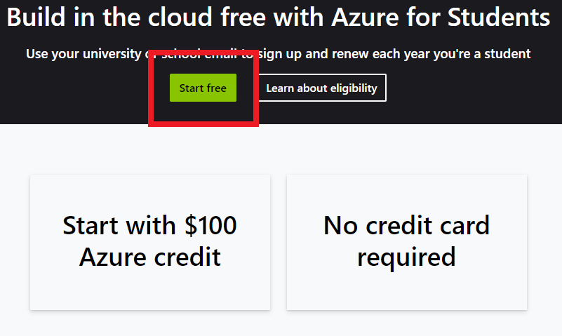

### MS Azure & Databricks Account setup

1. Go to https://azure.microsoft.com/en-us/free/students and click `Start free` button.
   

2. Log-in with your ČVUT `email` and `password`.
3. Fill in Student Verification and Profile forms:
   
   
   

4. Once Azure account is created, click **Create a resource** in a panel of Azure services and search for `Databricks`
   
   

5. Choose `Azure Databricks` resource and click **create**.
   

6. Fill out following fields, create a new Resource group if needed.

- **Subscription**: Azure for Students
- **Region**: West Europe
- **Pricing Tier**: Standard
  
  

7. Click **Review + Create** and wait till resource is deployed.

8. Once deployed, launch **Databricks Workspace**
   
